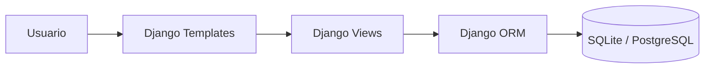
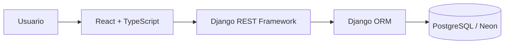

# Visao Geral da Arquitetura

## Estado atual

O CRM.Pro hoje e um monolito Django com Django Templates. O projeto possui um app principal, `leads`, que concentra modelos, forms, views, URLs, templates, dashboard, exportacao CSV, cadastro, perfil e interacoes.

O estado confirmado no codigo atual:

- `Lead` pertence a um usuario por `agente_responsavel`.
- `Interaction` pertence a um `Lead` e, indiretamente, ao mesmo usuario.
- As views principais limitam querysets por usuario autenticado.
- O dashboard calcula metricas no mesmo modulo de views.
- A exportacao CSV tambem vive em `leads.views`.
- Os settings ja estao separados em `development`, `test` e `production`.
- O frontend atual e server-rendered com Bootstrap, CSS/JS inline e Chart.js.

## Arquitetura-alvo

A arquitetura-alvo e um monolito modular Django com Django REST Framework no backend e uma SPA React + TypeScript separada no frontend.

## Modulos previstos

- `accounts`: usuario autenticado, perfil, cadastro, autenticacao, senha e endpoint `me`.
- `leads`: cadastro, listagem, filtros, status, prioridade e propriedade dos leads.
- `interactions`: historico, notas, datas e vinculo com leads.
- `dashboard`: metricas, agregacoes, funil, graficos e consultas por periodo.
- `reports`: CSV, exportacoes, sanitizacao e limites.
- `common`: excecoes, paginacao, permissoes e validadores realmente compartilhados.

## Principios

- Preservar comportamento antes de refatorar.
- Querysets devem nascer escopados pelo usuario autenticado.
- Nao chamar o modelo atual de multi-tenant real.
- Services so entram quando houver regra de negocio, transacao ou efeito colateral real.
- Selectors entram para consultas reutilizaveis, agregadas ou otimizadas.
- Nao criar pastas/classes vazias para simular arquitetura.
- O frontend deve manter estado remoto no TanStack Query e estado local perto de onde e usado.

## Decisoes ja tomadas

- Backend sera monolito modular, nao microservicos.
- API sera versionada em `/api/v1/`.
- Erros terao formato consistente.
- Validacoes comuns da API usarao `400 Bad Request`, alinhado ao DRF.
- Frontend sera organizado por features.
- Zustand nao sera instalado inicialmente.
- PostgreSQL/Neon entram antes de depender da API como fonte final.

## Itens ainda nao decididos

- Estrategia final de JWT e armazenamento de tokens.
- Refresh token em cookie `HttpOnly`, memoria ou outra estrategia.
- Organizacoes/memberships/roles ou apenas isolamento por usuario.
- Soft delete ou exclusao definitiva.
- Auditoria de alteracoes.
- Campos adicionais de lead, como valor estimado, origem e pipeline.
- Tarefas assincronas.
- Retencao de dados.
- Provider de e-mail.
- Deploy inicial definitivo do backend.
- Dominio, observabilidade e AWS.

## Fases da migracao

1. Proteger comportamento atual com testes de caracterizacao.
2. Corrigir bugs e inconsistencias do monolito atual.
3. Revisar dominio, constraints, indices e PostgreSQL.
4. Introduzir DRF, API, filtros, paginacao, erros, OpenAPI e JWT.
5. Criar frontend React separado por features.
6. Finalizar infraestrutura, CI, deploy e documentacao.

## Riscos arquiteturais

- Quebrar isolamento por usuario ao criar endpoints.
- Refatorar views/templates antes de cobrir comportamento atual.
- Migrar para PostgreSQL sem revisar nullable, indices e constraints.
- Duplicar estado remoto no frontend.
- Criar services/repositories genericos sem beneficio real.
- Expor detalhes internos ou dados de outro usuario por erros e filtros.
